# AIBroker

> A plugin-based server-management broker for AI tools. One token per client, one
> policy per server, every call audited.

AI coding tools (Claude Code, Codex, and any MCP-compatible client) talk to AIBroker
through a single HTTP MCP endpoint. AIBroker checks **who** is asking, **which server
plugin instance** they are targeting, and **which tools** the bound policy allows. The
built-in WordPress plugin then runs the action with credentials that never leave the
broker. Clients never see WordPress passwords, SSH keys, or WP-CLI config.

This keeps access centralized, revocable, and auditable: rotate a token, change a
policy, or unbind a server and every affected client's behavior changes in one place.

---

## Table of contents

- [What AIBroker does](#what-aibroker-does)
- [How it fits together](#how-it-fits-together)
- [Quick start](#quick-start)
- [Connect your existing WordPress site](#connect-your-existing-wordpress-site)
- [The access model in one minute](#the-access-model-in-one-minute)
- [Roles](#roles)
- [The admin UI](#the-admin-ui)
- [The MCP tool surface](#the-mcp-tool-surface)
- [Connecting an AI client](#connecting-an-ai-client)
- [Throwaway WordPress test servers](#throwaway-wordpress-test-servers)
- [Day-to-day `dev.sh` commands](#day-to-day-devsh-commands)
- [Testing](#testing)
- [Configuration](#configuration)
- [Production operations](#production-operations)
- [Project layout](#project-layout)
- [Further reading](#further-reading)
- [Comparison to similar projects](#comparison-to-similar-projects)

---

## What AIBroker does

- **One token per client.** Each AI client (or script) holds a single AIBroker token.
  WordPress application passwords, SSH keys, and WP-CLI paths live in the broker and
  are never shipped to the client machine.
- **Plugin-based servers.** A server stores only its name and address. Independently
  configured plugin instances contribute tools, credentials, and discovered capabilities.
- **Policy-based access.** A *policy* lists which MCP tools are allowed or denied (with
  optional constraints). A *binding* attaches a policy to a (group or user) × server pair.
  A *group* collects users. The broker evaluates every call against the matching
  binding's policy.
- **Safe tool exposure.** WordPress, typed PostgreSQL, confined SSH, and isolated Playwright
  browser tools are exposed over a streamable-HTTP MCP endpoint. SSH onboarding uses a one-time
  sudo-capable credential to provision a dedicated account; only its generated confined key is
  retained. Browser calls run in a private Chromium sidecar restricted to exact configured origins.
- **Visible break glass.** Raw `ssh.run_command` is critical, Full-only, justification-required,
  fully captured, and emits a distinct `break_glass_used` audit event. PostgreSQL follows the
  same pattern: typed reads are the default while `postgres.run_sql` is Full-only and queued.
- **Full audit trail.** Every login, token use, policy/group/binding change, and tool
  call is recorded with actor, server, tool, status, and a before/after diff where
  relevant.
- **Self-service for everyone.** Regular users manage their own tokens, set up their
  clients from a guided page, and see their own activity — no admin needed for the
  basics.

---

## How it fits together

```
                 ┌─────────────┐   MCP (HTTP, Bearer token)
  AI client ───▶ │  AIBroker   │ ──── POST /mcp ────▶ policy check ──▶ tool run
  (Claude Code,  │   API       │                       │
   Codex, …)     │  :8080      │                       ├─▶ WordPress REST  (app password)
                 └─────────────┘                       ├─▶ WP-CLI / confined shell over SSH
                        │                                └─▶ PostgreSQL scoped role
                        │
              ┌─────────┴─────────┐
              ▼                   ▼
        PostgreSQL :5432      Redis :6379
        (policies, groups,     (rate limits,
         bindings, audit)       job queue)
              ▲
              │  admin / self-service
        ┌─────┴──────┐
        │  Web UI    │  React + Vite, :3000
        │  :3000     │  proxies /admin /me /auth /health to the API
        └────────────┘
```

**Request flow for a tool call:**

1. The client connects to the native MCP endpoint (`POST /mcp`, Streamable-HTTP) with
   `Authorization: Bearer <aibroker-token>` and issues `tools/call`. (A dev-only
   `POST /mcp/call` REST shim accepting `{ tool, input }` is retained for smoke tests.)
2. The API resolves the token to its owner, records `last_used_at`, and enforces rate
   limits (Redis).
3. The **policy evaluator** finds the matching binding for `(user-or-group, server)` and
   applies the policy: deny-wins, union across groups, constraint narrowing, and global
   hard stops (write-tools / production-writes / server-disabled).
4. If allowed, the tool executor runs against the server (WordPress REST, WP-CLI-over-SSH,
   PostgreSQL, or the isolated Playwright worker), using credentials stored encrypted in PostgreSQL.
5. The call and its outcome are written to the audit log, win or lose.

Provisioned SSH and PostgreSQL plugins use a bootstrap-once pattern. An elevated key or
admin connection string exists in memory only long enough to create or rotate a confined
identity; AIBroker encrypts only that scoped identity for later calls.

The **Web UI** is just a browser over those same endpoints — admins manage users,
groups, servers, and policies; everyone manages their own tokens, settings, and client
setup. The UI calls `/admin/*` (admins), `/me/*` (self-service, any role), and
`/auth/*` (login / change password).

---

## Quick start

You need **Docker** and (for non-Linux hosts) **corepack/pnpm** available for the
dependency-install step. The whole stack runs in Docker Compose.

```sh
# 1. Configure environment
cp .env.example .env
#   then edit .env: set AIBROKER_SESSION_SECRET to a long random string, and
#   AIBROKER_ENCRYPTION_KEY_BASE64 to: openssl rand -base64 32

# 2. (one time) install local dependencies so typecheck/tests work on the host
./dev.sh deps-install        # or: corepack pnpm install

# 3. Bring up the full dev stack (API + Web + worker + Postgres + Redis + WordPress)
./dev.sh run
```

Once it's up:

- **Web UI:** http://localhost:3000
- **API health:** `http://localhost:8080/health/live` (liveness) and
  `http://localhost:8080/health/ready` (readiness — checks DB + Redis)
- **WordPress (the bundled demo server):** http://localhost:8081

On startup, the API applies the schema and synchronizes the code-defined plugin, tool, and
built-in policy catalog automatically. The commands remain available for explicit maintenance:

```sh
./dev.sh migrate             # explicitly run database migrations
./dev.sh seed                # explicitly resynchronize tools, plugins, policies, and local admin
```

The seeded local admin comes from `AIBROKER_BOOTSTRAP_ADMIN_EMAIL` /
`AIBROKER_BOOTSTRAP_ADMIN_PASSWORD` in `.env` (defaults to `admin@example.com` /
`change_me_in_local_dev`). The API prints these configured credentials only while the
bootstrap password still requires rotation. On first login you'll be prompted to change the
password; subsequent starts do not echo the credentials.

> Tip: To try the full end-to-end flow against a *real* throwaway WordPress server, start
> the stack with a test server instead: `./dev.sh run --wptest server1`. See
> [Throwaway WordPress test servers](#throwaway-wordpress-test-servers).

---

## Connect your existing WordPress site

This walkthrough starts with your website address and WordPress login. It connects
an existing site through WordPress's REST API (the interface applications use to
read and change site content). You can do this in a browser; this connection does
not require SSH, a hosting control panel, or installing an AIBroker plugin inside
WordPress. Server maintenance features that require SSH need separate setup by
someone with hosting access.

### 1. Get access to AIBroker

1. Ask the person running AIBroker for its web address and an AIBroker account.
   Your WordPress login and your AIBroker login are separate accounts.
2. Open that address, sign in, and change your initial password if prompted.
3. Look for **Servers** and **Groups** in the sidebar. Registering a site and
   granting access requires an AIBroker administrator. If those pages are missing,
   ask that administrator to carry out steps 4–6 with you. You can still prepare
   the WordPress details in steps 2–3 yourself.

If nobody has installed AIBroker yet, ask the person who will operate it to follow
[Quick start](#quick-start) first and give you the resulting web address. The
`localhost` addresses there work on the machine running the stack; they are not
the address of your existing WordPress site.

### 2. Sign in to WordPress and find your site details

1. Open your usual WordPress login page. For a site at `https://example.com`, this
   is normally `https://example.com/wp-admin/`. Replace `example.com` with your
   own domain. Use your usual custom login address if your site has one.
2. Sign in with your existing WordPress credentials and complete any two-factor
   authentication prompt.
3. Open **Users → Profile**, or **Profile** if that is the menu shown for your
   account. Note the **Username** displayed there, especially if you normally
   sign in with an email address. You will enter this username in AIBroker.
4. Note the site's HTTPS base address, such as `https://example.com`. Preserve
   a site subdirectory if applicable, such as `https://example.com/blog`.
   Leave off `/wp-admin/`, `/wp-login.php`, and `/wp-json/`.
5. To check the API address, open that base address followed by `/wp-json/` in
   a new browser tab, for example `https://example.com/wp-json/`. A page of
   structured text containing keys such as `name` and `namespaces` is expected.
   This checks availability, not your credentials. If you get an error or a
   normal webpage, ask your WordPress administrator or host to confirm the REST
   API base address before continuing.

### 3. Create a WordPress application password

1. Return to your WordPress **Profile** and find **Application Passwords**.
2. Enter `AIBroker` as the application name and click **Add New Application Password**.
3. Copy the generated password immediately into a password manager; WordPress
   shows it only once. This is the password to enter in AIBroker. Keep using your
   usual password for WordPress browser logins.
   AIBroker accepts it **with or without spaces**: you can paste it exactly as
   WordPress displays it. AIBroker passes it through unchanged, and WordPress
   removes the spaces when validating it.

If the section is missing, ask your WordPress administrator or hosting support:
“Please enable WordPress Application Passwords for my account, confirm HTTPS is
working, and confirm authenticated REST API access is allowed.” This feature
requires WordPress 5.6 or newer and is normally available over HTTPS; site security
settings can disable it. See the official
[WordPress application password guide](https://developer.wordpress.org/advanced-administration/security/application-passwords/).

### 4. Register the site in AIBroker (administrator)

1. In AIBroker, open **Servers → + Add server**.
2. Enter a recognizable name, for example `Company website`.
3. In **IP address or hostname**, enter the site's hostname, for example
   `example.com`, without `https://` or a path. Click **Save**.
4. Click the new server's name, open **Plugins**, and click **+ Add plugin**.
5. Select **WordPress** and use `WordPress` as the instance name.
6. Fill in the configuration as follows, then click **Save**:

   | Field | What to enter |
   |-------|---------------|
   | `base_url` / Base URL | The complete HTTPS base address from step 2, for example `https://example.com` or `https://example.com/blog`. The default is `https://${server.address}`; include a subdirectory if your site needs one. |
   | `wordpress_path` / WordPress path | Leave empty for this REST-only setup. This is a filesystem path used for SSH operations. |
   | `wp_cli_path` / WP CLI path | Leave the default `wp`; it is not needed for this REST connection. |

Here, **WordPress plugin** means a connector inside AIBroker. You add it on the
AIBroker page, not on WordPress's Plugins page.

### 5. Save the credential and test the connection (administrator)

1. In the WordPress plugin row, click **Add credential** (or **Replace credential**
   if one is already stored).
2. Enter the **WordPress username** from step 2 and the generated **Application
   password** from step 3. Click **Save credential**.
3. Click **Test connection** in that plugin row and wait for the result.
4. Once the test succeeds, open the server's **Capabilities** tab to see which
   operations are available. Some operations require additional WordPress
   permissions or SSH access and may be unavailable with this setup.

If another person performs this step, share the application password through your
organization's approved secret-sharing method. Enter it only in the credential
form, not in an AI conversation. AIBroker stores it encrypted and does not show
it again.

### 6. Grant your AIBroker account access (administrator)

A successful connection test does not grant users access to the site. Add a
binding: a rule connecting a group, a server, and a policy that specifies allowed
actions.

1. Open **Groups → + Add group**. Name it, for example, `Website readers`, add
   an optional description, and click **Save**.
2. Open that group, select **Members → + Add member**, choose the AIBroker
   account that will use the AI client, and click **Save**.
3. In the same group, select **Servers → + Bind server**.
4. Choose `Company website` (or the name you used) and the built-in **read-only**
   policy. Click **Save**. This lets you verify the connection with read operations.
5. Use the group's **Effective access** tab to review the resulting permissions.

Later, an administrator can change the binding to a policy allowing the required
editing or publishing actions. WordPress also checks the permissions of the account
whose application password you saved; a broker policy cannot grant permissions
that account does not have.

### 7. Connect your AI client and confirm it works

1. Sign in to AIBroker as the account added to the group in step 6.
2. Open **Tokens → + Add token**, enter a name such as `My AI client`, choose
   an expiration, and save. If an administrator sees an owning-user selector,
   select the account granted access in step 6.
3. Copy the token immediately and store it securely. This token connects your AI
   client to AIBroker; it is separate from the WordPress application password.
4. Open **Client Setup**, enter the broker URL supplied by your administrator,
   and select or paste the new token. Select your client's tab and follow its
   displayed setup instructions. See [Connecting an AI client](#connecting-an-ai-client)
   for the supported clients and configuration locations.
5. Reload or restart your client if its setup instructions require it. Ask:
   “Use AIBroker to list my WordPress sites, then list the pages on Company website.
   Do not change anything.” Substitute your server name.
6. Confirm your site appears and the page list is returned (an empty list is valid
   if the site has no accessible pages). An administrator can check the server's
   **Audit** tab for the corresponding calls.

### If something goes wrong

| What you see | What to do next |
|--------------|-----------------|
| No **Servers** or **Groups** in AIBroker | Ask an AIBroker administrator to complete steps 4–6. WordPress administrator status does not grant AIBroker administrator status. |
| Connection test rejects the credential | Recheck the WordPress username and generated application password. If necessary, create a new application password and use **Replace credential**, then test again. |
| Correct credentials still produce 401/403 | Ask the WordPress administrator or host to check the account's permissions, security rules, and whether the web server forwards the `Authorization` header to WordPress. |
| API not reachable, 404, timeout, or certificate error | Check the plugin's HTTPS base URL, including any subdirectory. Ask the host and broker operator to verify that the broker can reach the REST API and that HTTPS works. A site reachable from your browser may still be blocked from the broker. |
| Connection succeeds, but the AI cannot see the site or access is denied | Check that the token belongs to the user added to the group, the group has the correct server binding, and the server and plugin are enabled. Review **Effective access**. |
| Reading works, but editing fails | Check both the AIBroker policy and the WordPress account's permissions. The initial **read-only** policy deliberately does not allow edits. |

To disconnect this integration from WordPress, return to **Profile → Application
Passwords**, find the `AIBroker` entry, and click **Revoke**. To replace its password,
create a new one, save it through **Replace credential** in AIBroker, test the
connection, and then revoke the old entry. Revoking an AIBroker token on **Tokens**
instead disconnects that AI client.

---

## The access model in one minute

Three concepts, composed:

- **Policy** — a named plugin-relative access intent. The common path is one persona dropdown
  per plugin: **None / Read / Contribute / Manage / Full**. Advanced mode exposes the domain ×
  action grid, risk ceiling, explicit tool denies, and per-instance overrides. Saving
  materializes the intent to explicit tool rows for fast enforcement. New low/medium-risk
  tools can join matching intents automatically; high/critical tools wait in the review queue.
- **Group** — a collection of users. Most access is granted *to a group*.
- **Binding** — attaches one policy to a `(subject, server)` pair, where the subject is a
  group or a single user. This is the thing that actually grants access.

To give a user access to a server:

1. Create or pick a **policy** (Policies tab → choose a persona level per plugin).
2. Create or pick a **group** (Groups tab) and add the user to it (Members sub-tab).
3. Bind the group to the **server** and choose the policy for that server (Servers sub-tab).
4. (Optional) Use the **Effective access** view to see exactly which binding/policy
   allows or denies a given tool.

Direct user-to-server bindings exist for exceptions, but groups are the norm.

---

## Roles

| Role          | What they can do |
|---------------|------------------|
| `global_admin` | Everything: manage all users/groups/servers/policies/tokens, view audit logs. |
| `team_admin`  | Manage users/groups/servers within their ownership subtree; consume (not edit) policies. |
| `auditor`     | Self-service only (like `user`); intended for read/review. |
| `user`        | Self-service: their own tokens, settings, client setup, and personal dashboard. |

Regular users (`user`, `auditor`) see only **Dashboard**, **Tokens**, **Host Access**,
**Client Setup**, and **Settings** in the sidebar — the admin areas are hidden because the
backing API would deny them anyway. Nav visibility mirrors API permissions, so a tab is never
shown to a role that can't use it. (Host Access is self-service but still policy-gated: it only
lets a user act on servers their own bindings already allow.)

---

## The admin UI

The Web UI is a single-page app served on `:3000` that proxies `/admin`, `/me`, and
`/auth` to the API. A left sidebar lists the workspace areas; **nav visibility mirrors what
the API enforces**, so a role never sees a tab it would only be denied. Every page carries a
top bar with the page title, the signed-in identity and role, and a live **API ok/…** status
pill; the sidebar footer holds the light/dark theme selector and **Sign out**.

The screenshots below are from a freshly seeded local stack in dark theme (the UI ships both
light and dark, switchable from the sidebar).

### Sign in

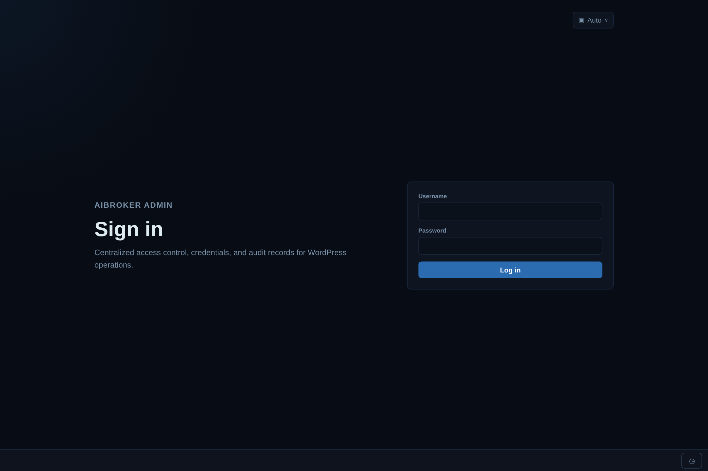

**What it does:** authenticates a user and starts a browser session (stored client-side and
sent as a header on every API call).

**On the page:**
- **Username** and **Password** fields and a **Log in** button; a failed attempt shows an
  inline error, never revealing whether it was the email or the password.
- A **theme selector** (Auto / Light / Dark) in the top corner, available before login.
- On first launch the bootstrap admin is redirected to a **Change password** screen — current
  password, new password with a live **strength meter**, and confirm — before the workspace
  unlocks (see [Quick start](#quick-start)).

### Dashboard

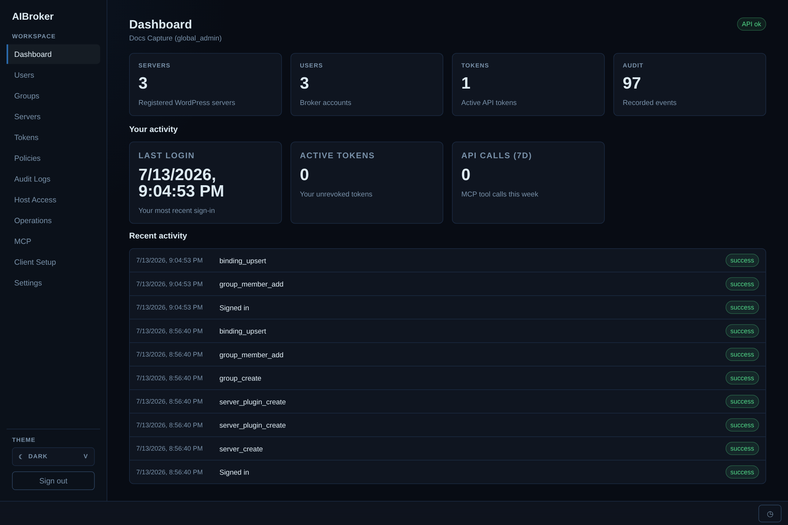

**What it does:** an at-a-glance landing page — workspace health for admins, personal activity
for everyone.

**On the page:**
- **Summary tiles** (admins only): **Servers** (registered), **Users** (broker accounts),
  **Tokens** (active API tokens), **Audit** (recorded events).
- **Your activity** (all roles): **Last login**, **Active tokens** (your unrevoked tokens),
  and **API calls (7d)** (your MCP tool calls this week).
- **Recent activity**: a feed of the latest audited events — timestamp, event type, and a
  success/failure status chip. Regular users and auditors see only the personal panels.

### Users

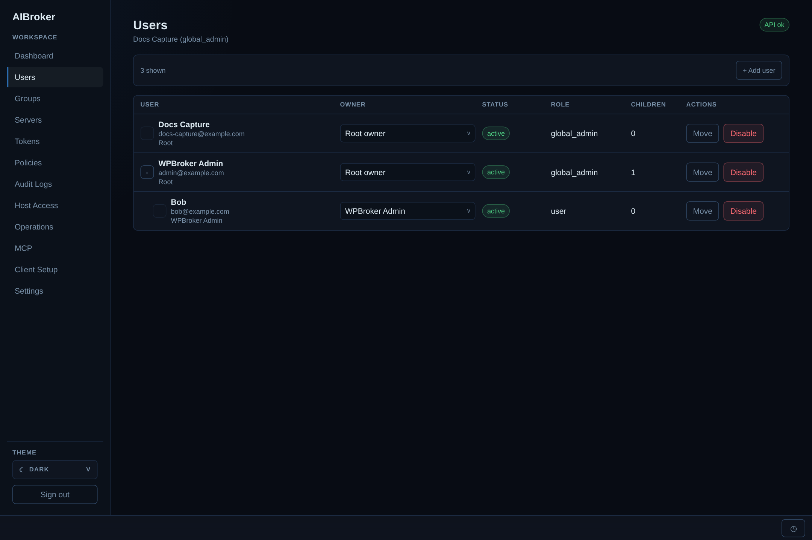

**What it does:** manage broker accounts, roles, and the ownership hierarchy (admins only).

**On the page:**
- Header count and **+ Add user** (a modal for email, display name, initial password, role,
  and owner).
- Table columns: **User** (display name, email, owner path), **Owner** (an inline dropdown to
  reassign ownership), **Status** chip, **Role**, **Children** (how many accounts this user
  owns), and **Actions** — **Move** and **Disable**.
- Clicking a user opens a **detail page** (back arrow to return) with **Overview / Bindings /
  Effective access** tabs and an **Edit** button on the header. Team admins only see accounts
  within their ownership subtree.

### Groups

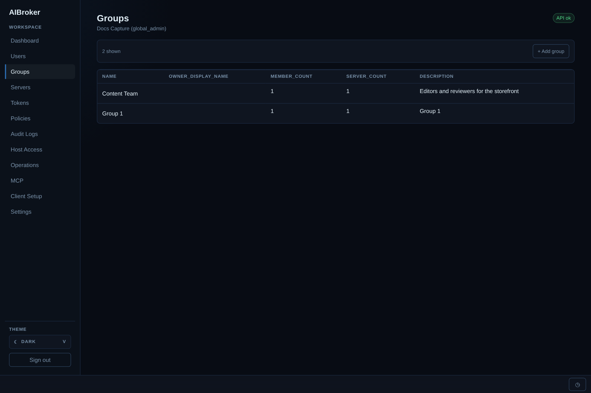

**What it does:** groups collect users and are the normal unit that access is granted to
(admins only).

**On the page:**
- **+ Add group** (name and description).
- List columns: **name**, **owner**, **member count**, **server count**, and **description**.
- The detail page has three sub-tabs: **Members** (add/remove users), **Servers** (the group's
  bindings — each row pairs a server with the policy it grants, so this is where you bind a
  policy to a group × server), and **Effective access** (the resolved allow/deny result).

### Servers

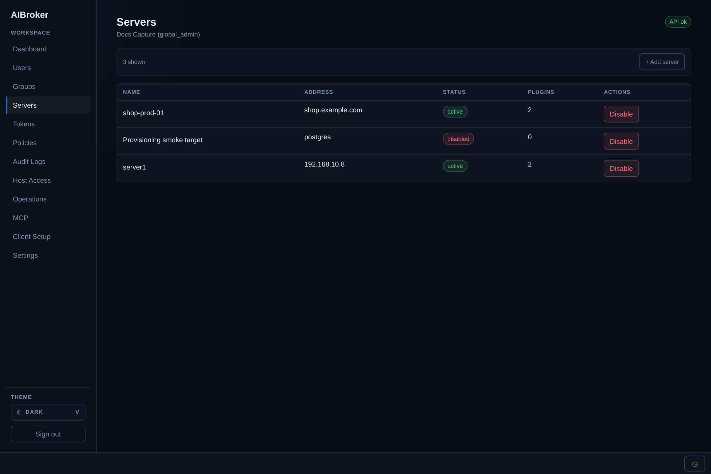

**What it does:** register the targets AIBroker acts on. A server row stores only a **name** and
**address**; tools, credentials, and capabilities all come from the plugin instances attached to
it.

**On the page:**
- **+ Add server** (name and address only).
- List columns: **name** (links to the detail page), **address**, **status** chip, **plugins**
  (count of enabled instances), and **Actions** (**Disable**).
- The detail page has **Overview / Plugins / Capabilities / Audit** tabs. **Capabilities**
  lists what each plugin discovered (plugin, capability, status, executor kind, discovered-at)
  with a **Discover capabilities** button; **Audit** is the server-scoped event slice.

**Plugins tab** — add and manage WordPress, SSH, PostgreSQL, and Playwright instances:

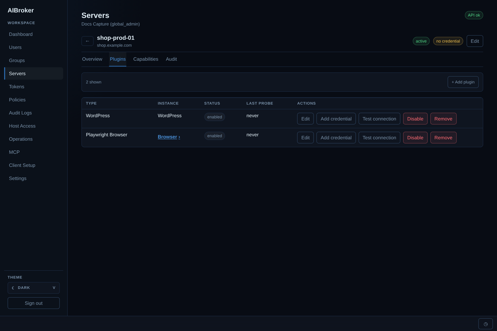

- **+ Add plugin** opens the catalog picker and a **schema-driven config form** (labelled
  strings, URLs, numbers, enums, booleans, and string lists — not raw key/value text).
- Columns: **type**, **instance**, **status** chip (or provisioning status), **last probe**,
  and a non-wrapping **Actions** group. Available actions depend on the plugin type: **Edit**;
  **Add/Replace credential** (WordPress, Playwright); **Provision / Rotate** and **De-provision**
  (SSH, PostgreSQL); **Test connection**; **Disable**; and **Remove** (which requires a reason
  and a typed confirmation, and is a retained/soft delete so audit history survives).
- Playwright is a **singleton** per server, and its instance name is a **drill-down link** (the
  `Browser ›` affordance) into a dedicated detail page.

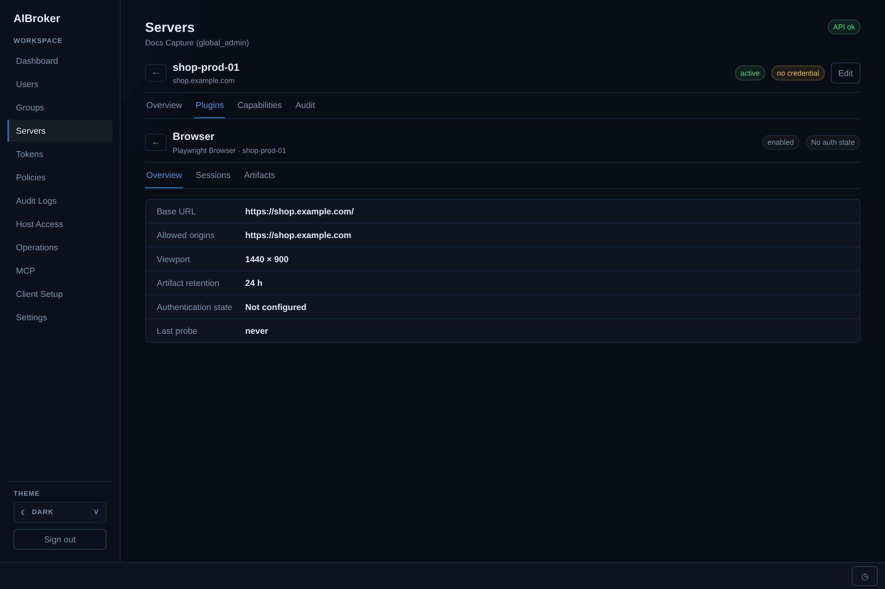

The browser detail page keeps browser administration out of the plugin list. Its header carries
the instance name, a status chip, and an auth-state chip, with three tabs:
- **Overview** — summary rows for **Base URL**, **Allowed origins**, **Viewport**, **Artifact
  retention**, **Authentication state**, and **Last probe**.
- **Sessions** — a table of short-lived token-owned browser contexts (status, current URL,
  actor, token prefix, last activity, idle-expiry) with an admin **Close** action that requires
  a reason.
- **Artifacts** — a table of expiring screenshots (type, MIME, byte size, abbreviated SHA-256,
  actor, status, created, expires). Only metadata is shown; screenshot **bytes are never
  displayed or exported here**.

### Policies

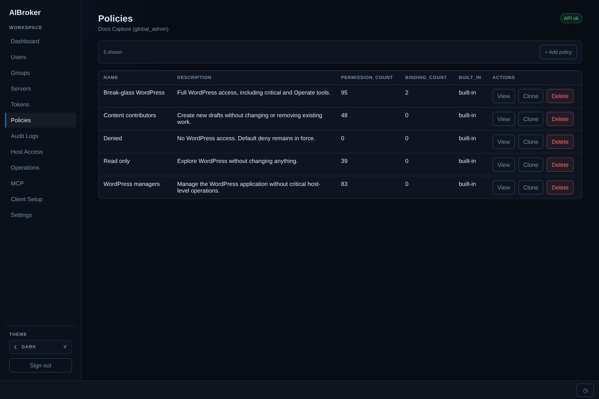

**What it does:** a policy is a named, plugin-relative access intent that gets materialized into
explicit allow/deny tool rows (admins only).

**On the page:**
- **+ Add policy**, plus list columns: **name**, **description**, **permission count** (how many
  tool rows it materializes to), **binding count** (how many bindings use it), a **built-in**
  marker, and **Actions** — **View**, **Clone**, **Delete** (built-ins can be viewed and cloned
  but not deleted).
- The editor uses a **persona ladder** per plugin — **None / Read / Contribute / Manage /
  Full** — by default. **Advanced** mode exposes the **domain × action grid**, a **risk
  ceiling**, explicit **tool denies**, and **per-instance overrides**.
- A **Test policy** panel previews the effective result: pick a **user** and a **server** and it
  returns a table of instance, tool, **allowed/denied**, and the deciding **reason**.

### Tokens

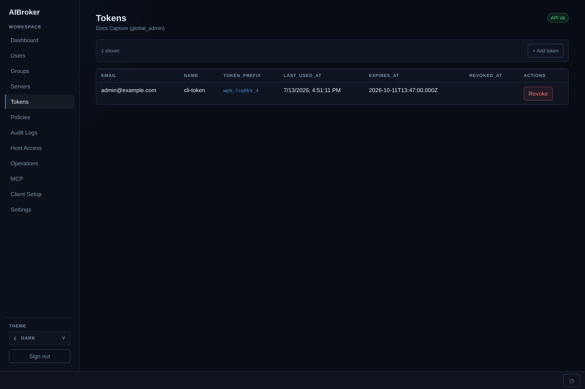

**What it does:** create and revoke API tokens — your own (all roles), or anyone's (admins).

**On the page:**
- **+ Add token** opens a modal for a **token name** and an **expiration** (date/time); the
  admin variant also picks the **owning user**.
- The full secret is shown **once** at creation — it's stored hashed and can never be retrieved
  again, so copy it then.
- List columns: **name**, **token prefix**, **last used**, **expires**, **revoked**, and
  **Actions** (**Revoke**); the admin view adds an **email** column. Revocation is irreversible
  and tokens are never hard-deleted, because the audit trail ties every tool call back to a token.

### Host Access

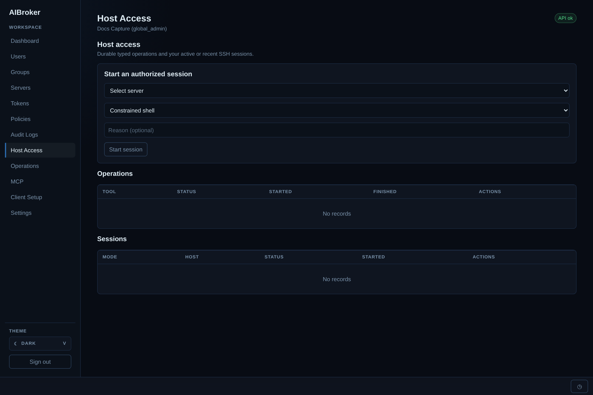

**What it does:** self-service SSH — start an authorized host session and track durable typed
host operations (all roles, still policy-gated).

**On the page:**
- **Start an authorized session** panel: a **server** dropdown (only servers your bindings
  allow), a **mode** dropdown (**Read-only shell / Constrained shell / Full Shell / Root
  Access**), an optional **Reason**, and a **Start session** button.
- **Operations** table: tool, status, started, finished, and an inline **Cancel** for queued or
  running operations.
- **Sessions** table: mode, host (`user@host`), status, started, and an inline **End** for
  active sessions. The page auto-refreshes.

### Operations

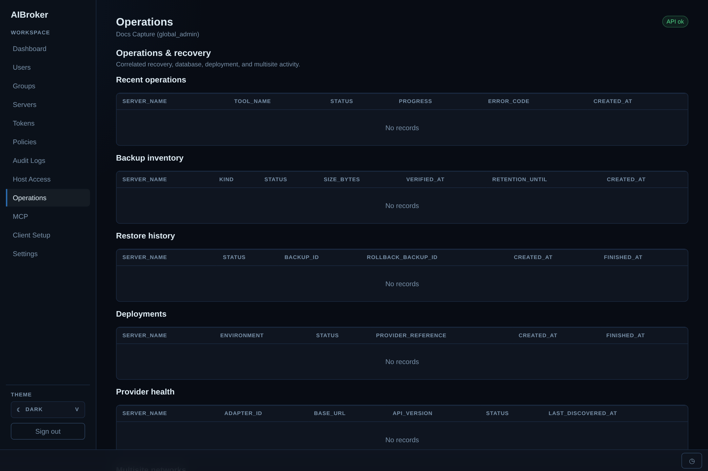

**What it does:** an admin-only, read-only correlation of recovery and infrastructure activity —
one place to answer "what ran, did it finish, and is there a backup to fall back to?"

**On the page** — six stacked tables:
- **Recent operations** (server, tool, status, progress, error code, created).
- **Backup inventory** (server, kind, status, size, verified-at, retention-until, created).
- **Restore history** (server, status, backup id, rollback backup id, created, finished).
- **Deployments** (server, environment, status, provider reference, created, finished).
- **Provider health** (server, adapter, base URL, API version, status, last discovered).
- **Multisite networks** (name, domain, base path, status, server count).

### Audit Logs

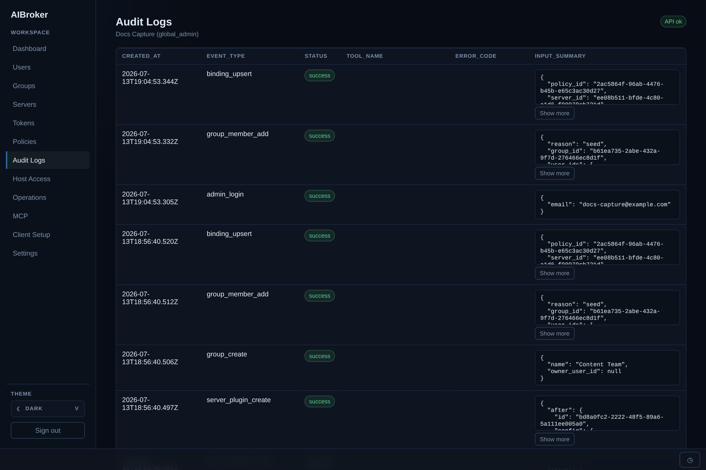

**What it does:** the full, immutable audit trail — every login, token use, policy/group/binding
change, and tool call (admins only).

**On the page:**
- Columns: **created at**, **event type**, **status** chip, **tool name**, **error code**, and
  **input summary** — a redacted JSON blob (secrets stripped) rendered in a fixed-height box
  with a **Show more / Show less** toggle so one large event can't scroll-bomb the list.

> **Sandbox** (development only, not shown) appears when `AIBROKER_SANDBOX_ENABLED` is set. It
> creates disposable PostgreSQL targets or exposes the bundled WordPress test target, with
> copyable connection details and a one-click register shortcut; teardown destroys the target
> but retains its audit record. **MCP** (admins, not shown here because MCP is disabled in this
> capture) is a live monitor of MCP tool traffic — a session table (session, state, started,
> duration, call count, error rate, servers), a filterable per-call traffic table, and NDJSON/CSV
> export. Each call can be expanded to reveal the encrypted request/response body, but only when
> `AIBROKER_MCP_CAPTURE_BODIES` is on; otherwise the monitor shows metadata only.

### Client Setup

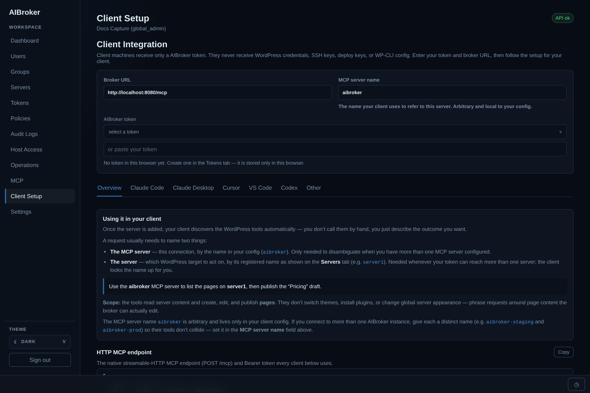

**What it does:** generates copy-paste-ready MCP configuration for each supported client
(all roles).

**On the page:**
- Inputs at the top: **Broker URL**, **MCP server name** (arbitrary, local to your client), and
  an AIBroker **token selector** with an "or paste your token" fallback.
- Sub-tabs — **Overview**, **Claude Code**, **Claude Desktop**, **Cursor**, **VS Code**,
  **Codex**, **Other** — each render config with your URL, token, and server name already
  interpolated, plus **Copy** buttons and a shared **HTTP MCP endpoint** block. See
  [Connecting an AI client](#connecting-an-ai-client).

### Settings

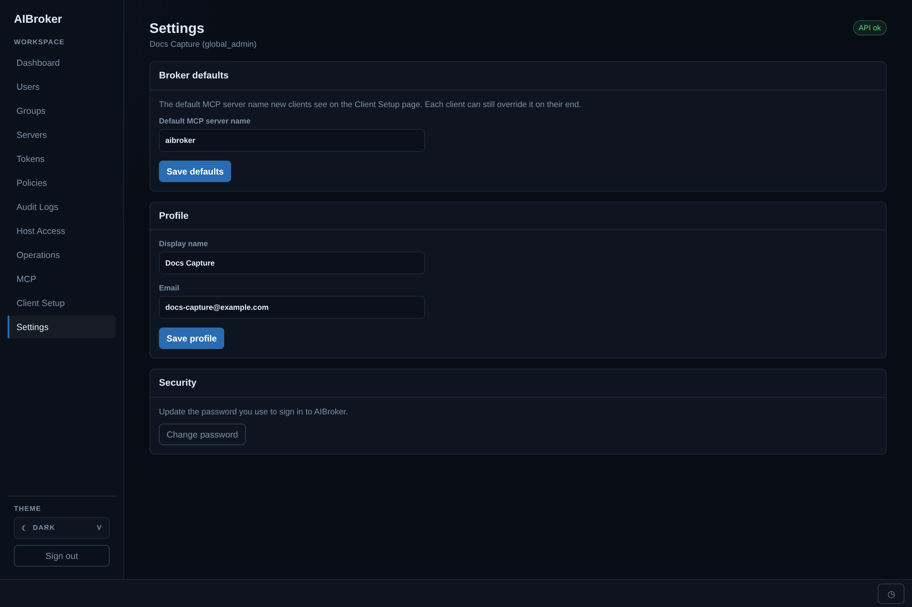

**What it does:** manage your own profile and (for admins) one workspace-wide default.

**On the page:**
- **Profile**: change your **display name** and **email**.
- **Change password**: current password, new password with a strength meter, and confirm.
- **Default MCP server name** (global admins only): the value new clients see pre-filled on the
  Client Setup page; each client can still override it locally.

---

## The MCP tool surface

Every client sees the same registry catalog over the `/mcp` endpoint; the policy on the
matching binding decides which tools the caller may actually run. Built-in plugin surfaces include:

- **Read** — `wordpress.list_sites`, `wordpress.get_site_summary`, `wordpress.list_pages`, `wordpress.get_page`
- **Write** — `wordpress.create_draft_page`, `wordpress.update_draft_page`, `wordpress.publish_page`
- **Diagnostic** — `wordpress.run_health_check`
- **PostgreSQL typed reads** — `postgres.list_tables`, `postgres.read_rows`, `postgres.run_named_query`
- **PostgreSQL break glass** — `postgres.run_sql` (Full/critical, reason and idempotency key required)
- **SSH** — confined file/session tools plus Full-only `ssh.run_command`
- **Browser inspection** — `playwright.capture_screenshot`, `playwright.get_page_metadata`,
  `playwright.get_page_snapshot` (low-risk reads) and `playwright.get_console_messages`,
  `playwright.get_page_errors` (medium-risk reads). Screenshots return native MCP image content plus
  a protected, expiring artifact reference; bytes never enter structured JSON or audit rows.
- **Browser sessions** — `playwright.open_session`, `playwright.navigate`, `playwright.list_sessions`,
  `playwright.close_session` open one short-lived, token-owned context (five-minute idle,
  fifteen-minute absolute lifetime).
- **Browser interactions** — strict semantic-locator tools `playwright.fill`, `playwright.select_option`,
  `playwright.press_key`, `playwright.wait_for`, and the write-classified `playwright.click`
  (idempotency key required). Values are redacted from audit and events; no arbitrary
  selectors, JavaScript, raw HTML, or navigation outside the configured origins.

Writes are governed only by explicit policy permissions on the matching server binding.
The seeded built-in policies (`read-only`, `editor`, `publisher`, `auditor`, `denied`) are
pre-wired to these categories: `read-only` allows the read tools, `editor` adds draft
create/update, `publisher` adds publish, and `auditor` allows read + diagnostic. Make
your own policy in the Policies editor by checking tools on or off.

---

## Connecting an AI client

From the **Client Setup** tab, enter your broker URL and choose a AIBroker token from the
selector (or paste one — create tokens on the **Tokens** tab). Then follow the sub-tab
for your client — each shows copy-paste-ready config that interpolates your URL, token,
and server name:

- **Claude Code** — `claude mcp add --transport http …` or a `.mcp.json` snippet.
- **Claude Desktop** — its config is stdio-only, so it uses the `mcp-remote` bridge.
- **Cursor** — a `~/.cursor/mcp.json` (or project `.cursor/mcp.json`) entry.
- **VS Code** — a `.vscode/mcp.json` entry for Copilot agent mode.
- **Codex** — a `~/.codex/config.toml` entry (token read from an env var).
- **Other** — the generic streamable-HTTP config + a curl smoke test.

The **MCP server name** (default `aibroker`, set org-wide by a global admin in Settings)
is how your client refers to this connection. It's arbitrary and lives only in your
client config — override it on the Client Setup page if you connect to more than one
AIBroker instance so their tools don't collide (e.g. `aibroker-staging`, `aibroker-prod`).

The endpoint every client uses is the native MCP surface at `http://<broker>/mcp`
(Streamable-HTTP, JSON-RPC) with `Authorization: Bearer <token>`. A dev-only
`POST /mcp/call` REST shim (`{ "tool": "...", "input": {...} }`) is kept for quick curl
smoke tests and is **not** the MCP protocol.

See [`docs/client-integration.md`](docs/client-integration.md) for the full details,
expected error codes, and token rotation.

---

## Throwaway WordPress test servers

`./dev.sh run --wptest <name>` brings up the full stack *and* a throwaway WordPress server
running alongside it, so you can exercise the real flow: register the server, bind a
policy, and call `wordpress.list_pages` / `wordpress.create_draft_page` to see allow/deny in action.

```sh
./dev.sh run --wptest server1          # start stack + a test server named "server1"
./dev.sh wptest-list                   # show test servers
./dev.sh wptest-stop server1           # stop it (keep data)
./dev.sh wptest-rm server1             # delete it and its data
```

Access details for the test server (admin login, REST application password, registration
and WordPress plugin settings, including `wordpress_path`) are written to
`data/wptest/<name>/config.txt` and printed at the end of the run.
Re-running reuses an existing server; use `wptest-rm` for a clean slate.

---

## Day-to-day `dev.sh` commands

`dev.sh` is the main developer entrypoint. The most-used commands:

| Command | What it does |
|---------|--------------|
| `./dev.sh run` | Build and run the full stack in the foreground (Ctrl+C stops it). |
| `./dev.sh run --wptest NAME` | Same, plus a throwaway WordPress test server. |
| `./dev.sh migrate` | Run DB migrations (in the API container). |
| `./dev.sh seed` | Seed tool definitions, built-in policies, and the local admin. |
| `./dev.sh test` | Typecheck + tests across all packages. |
| `./dev.sh down` | Stop all AIBroker Docker services. |
| `./dev.sh logs` | Follow service logs. |
| `./dev.sh backup` | Local PostgreSQL backup via `AIBROKER_DATABASE_URL`. |

Run `./dev.sh help` for the full list (build, run-image, k3s-smoke, wptest-* management,
deps-status/deps-install, etc.).

`run`, `run-image`, and `run --wptest NAME` hide routine HTTP request starts and
successful completions from the console. Warnings, errors, failed HTTP responses,
and other output remain visible. Full Compose output is saved per run in
`data/logs/compose-*.log`; these files are not automatically rotated, so remove old
ones when no longer needed. Container logging is unchanged. Use `./dev.sh logs`
to follow unfiltered container logs, or `AIBROKER_CONSOLE_LOGS=full ./dev.sh run`
to show everything in the foreground (also works with `run-image` and `--wptest`).
Console filtering uses local Node.js; without it, the console shows full output.

Local app data lives under `./data`. To fully reset the local app: stop the stack and
delete `./data` — databases and the bootstrap admin are recreated on the next
`./dev.sh run` (then re-run `./dev.sh migrate && ./dev.sh seed`).

---

## Testing

```sh
./dev.sh test              # everything (typecheck + all package tests)
# or target a layer:
corepack pnpm --filter @aibroker/api test
corepack pnpm --filter @aibroker/web test
corepack pnpm --filter './packages/**' test
```

Tests are Vitest. The API tests use a mock DB harness for unit-level checks of routes
and governance; the DB package has migration tests against a real temp Postgres.

---

## Configuration

All runtime config comes from environment variables (see `.env.example`):

- **Required:** `AIBROKER_DATABASE_URL`, `AIBROKER_REDIS_URL`,
  `AIBROKER_SESSION_SECRET` (≥32 chars), `AIBROKER_ENCRYPTION_KEY_BASE64`
  (`openssl rand -base64 32`).
- **Feature flags (all default off):**
  - `AIBROKER_MCP_ENABLED` — advertises whether MCP is enabled to the UI/clients (it's
    surfaced through the `/me` payload). The routes themselves stay registered.
  - `AIBROKER_ALLOW_PRIVATE_CONNECTOR_TARGETS` — let connectors (REST/SSH) reach private
    IPs; off by default to prevent SSRF toward internal networks.
  - `AIBROKER_MCP_CAPTURE_BODIES` — opt in to full-fidelity capture: the tool-call path
    encrypts the request input + result/error into `audit_events.encrypted_payload`
    (secrets still redacted) so the admin **MCP** monitor can reveal and export full
    bodies. Off by default — with it off, only metadata is recorded.
- **Bootstrap admin:** `AIBROKER_BOOTSTRAP_ADMIN_EMAIL` /
  `AIBROKER_BOOTSTRAP_ADMIN_PASSWORD` / `AIBROKER_BOOTSTRAP_ADMIN_NAME`.
- **Playwright browser worker:** `AIBROKER_BROWSER_WORKER_URL` and the shared
  `AIBROKER_BROWSER_WORKER_SECRET`. Browser access remains exact-origin scoped; local/private
  browser targets additionally require `AIBROKER_BROWSER_ALLOW_PRIVATE_TARGETS=true` and a
  server marked `local` or `throwaway`. `AIBROKER_BROWSER_MAX_CONCURRENT` bounds simultaneous
  operations and `AIBROKER_BROWSER_MAX_SESSIONS` bounds live in-memory contexts. Sessions have
  fixed five-minute idle and fifteen-minute absolute lifetimes.
- **Browser artifacts:** local development uses `AIBROKER_ARTIFACT_BACKEND=filesystem` and
  `AIBROKER_ARTIFACT_FILESYSTEM_ROOT`. Production uses the S3-compatible endpoint, region,
  bucket, access-key, and secret-key variables listed in `.env.example`. Screenshot bytes are
  not stored in PostgreSQL or MCP audit bodies.

> ⚠️ **Rebuild note:** the dev Docker images bake the source in at build time (there's
> no live source volume mount), so after editing app code you need to rebuild for the
> running containers to pick it up: stop the stack and re-run `./dev.sh run` (which does
> `docker compose up --build`).

---

## Production operations

- **Kubernetes:** `deploy/k8s/` manifests and `deploy/helm/` chart scaffold.
- **Alerts:** `deploy/alerts/prometheus-rules.yaml`.
- **Backup / restore:** `scripts/backup-postgres.sh`, `scripts/restore-postgres.sh`,
  `scripts/backup-drill.sh`.
- **Runbooks:** [`docs/production-runbook.md`](docs/production-runbook.md),
  [`docs/security-operations.md`](docs/security-operations.md).
- **Smoke a k3s deployment:** `./dev.sh k3s-smoke`.

---

## Project layout

```
apps/
  api/        Fastify API: auth, admin + self-service routes, native MCP /mcp (+ dev /mcp/call), audit
  web/        React + Vite admin/self-service UI
  worker/     BullMQ worker for durable SSH and database operations
  browser-worker/ isolated Playwright/Chromium one-shot and leased-session runtime
  mcp-bridge/ stdio MCP bridge for clients without reliable HTTP (planned)
packages/
  core/       config, shared types, constraint registry
  policy/     the policy evaluator (deny-wins, union, constraints, hard stops)
  mcp-tools/  MCP tool definitions + executors (wp_* read/write/diagnostic)
  wordpress-rest/  WordPress REST client (application passwords)
  wpcli-ssh/  WP-CLI over SSH client
  audit/      audit event writer
  auth/       password hashing/verification, API token generation
  db/         raw-SQL migrations + seed (pg, no ORM)
  crypto/     credential encryption at rest
  artifacts/  filesystem and S3-compatible protected artifact storage
  plugin-playwright/ target-scoped browser inspection plugin
  plugin-catalog/ shared built-in plugin manifest
deploy/       docker, k8s, helm, alerts
docs/         design + operations docs
scripts/      backup/restore/smoke helpers
dev.sh        developer entrypoint (run/test/migrate/seed/wptest/…)
```

---

## Further reading

- [`docs/local-development.md`](docs/local-development.md) — deeper dev setup
- [`docs/uxdesign.md`](docs/uxdesign.md) — UI design guide and patterns
- [`docs/users.md`](docs/users.md) — user/role model
- [`docs/client-integration.md`](docs/client-integration.md) — connecting AI clients
- [`docs/disposable-wordpress.md`](docs/disposable-wordpress.md) — throwaway test servers
- [`docs/security-foundation.md`](docs/security-foundation.md) &
  [`docs/security-operations.md`](docs/security-operations.md) — security model + ops
- [`docs/production-runbook.md`](docs/production-runbook.md) — production operations
- [`docs/expansion-plan.md`](docs/expansion-plan.md) — optional roadmap

---

AIBroker is for authorized WordPress operations and security testing on servers you
administer. Don't use it to access servers you don't own.

---

## Comparison to similar projects

The projects below overlap with AIBroker in different ways. Some are general MCP hosting
platforms, some federate existing MCP servers, and some concentrate on filtering traffic.
The right choice depends mainly on whether you need to **run arbitrary MCP servers** or
want a broker to provide a **small, controlled set of infrastructure operations**.

This comparison is based on the projects' public documentation and repositories. Features
and licensing can change, so verify the linked project before making a production decision.

---

### Obot

[Obot](https://github.com/obot-platform/obot) is a self-hosted MCP platform that combines
server hosting, a registry, a gateway, an agent/chat client, and an administrative UI. It
can run stdio and HTTP MCP servers with Docker or Kubernetes and supports OAuth, users,
groups, access policies, audit logs, and per-user or shared credentials.

Key differences:

- Obot hosts and proxies general-purpose MCP servers; AIBroker implements a smaller catalog
  of server-management tools itself.
- Obot access policies primarily decide which users or groups can access an MCP server.
  AIBroker policies operate at individual tool level and add risk ceilings, constraints,
  explicit denies, and per-instance overrides.
- Obot includes model configuration, chat, RAG, memory, workflows, scheduling, registry
  discovery, and GitOps-managed server definitions. AIBroker does not try to be an agent or
  chat platform.
- Obot's Kubernetes deployment is the more suitable of its runtimes for untrusted MCP code;
  its own documentation describes the Docker runtime as appropriate for development or
  trusted, single-tenant use. AIBroker does not accept arbitrary MCP server packages to run.
- Obot is a substantially larger and more established project. AIBroker has a narrower
  integration set and a smaller community.

Choose Obot if you need an organization-wide MCP catalog, arbitrary server hosting, OAuth
integration, external and built-in chat clients, or Kubernetes-based multi-user operation.

Choose AIBroker if the required tools are among its supported WordPress, PostgreSQL, SSH,
and browser operations and you prefer those operations to be constrained and governed by
the broker instead of installing a separate general-purpose MCP server for each system.

---

### ToolHive

[ToolHive](https://github.com/stacklok/toolhive) runs MCP servers in isolated containers and
provides a gateway, registry, policy enforcement, identity integration, audit logging,
observability, a desktop workflow, and a Kubernetes operator.

Key differences:

- ToolHive is an MCP runtime and platform for existing or third-party servers. AIBroker's
  plugins define both the exposed tools and how privileged operations are executed.
- ToolHive has stronger general server isolation and lifecycle management, including a
  Kubernetes operator. AIBroker currently has deployment manifests but is not a general MCP
  workload orchestrator.
- ToolHive offers OIDC/OAuth integration, OpenTelemetry, Prometheus metrics, and a broader
  client and registry ecosystem. AIBroker currently uses its own account, session, and token
  model and has a smaller operational footprint.
- AIBroker has domain-specific controls such as scoped PostgreSQL roles, confined SSH
  identities, exact-origin browser access, and explicit break-glass tools. Comparable safety
  in ToolHive depends on the selected MCP server and its policy and container configuration.
- ToolHive is more mature and has a larger contributor and release ecosystem.

Choose ToolHive if you want a general secure runtime for a fleet of MCP servers, especially
on Kubernetes, or need standard identity and observability integrations.

Choose AIBroker if you do not need arbitrary MCP hosting and value the built-in provisioning
and policy semantics for the particular infrastructure systems it supports.

---

### ContextForge

[IBM ContextForge](https://github.com/IBM/mcp-context-forge) is a registry and gateway that
federates MCP and A2A servers as well as REST and gRPC APIs. It provides authentication,
SSO, RBAC, plugins, rate limiting, caching, observability, and multi-gateway federation.

Key differences:

- ContextForge is primarily a protocol federation and governance layer. It can turn several
  kinds of upstream service into a unified tool surface; AIBroker directly implements its
  supported infrastructure connectors.
- ContextForge supports more protocols, identity providers, plugins, and observability
  backends and is designed for larger, distributed gateway deployments.
- AIBroker's policy model is tied to users or groups, target server instances, plugin tools,
  risk levels, and operation-specific constraints. ContextForge provides broader gateway
  controls but does not give every upstream tool the same domain-specific confinement.
- ContextForge has more configuration and operational surface area. That flexibility is
  useful for heterogeneous estates but may be unnecessary for a small set of managed hosts.

Choose ContextForge if the main requirement is to federate many existing MCP servers, agents,
and APIs behind shared discovery, SSO, routing, and observability.

Choose AIBroker if the main requirement is tightly scoped administrative access to its
supported server types and the upstream systems should never receive client-held privileged
credentials.

---

### MCP Gateway Registry

[MCP Gateway Registry](https://github.com/agentic-community/mcp-gateway-registry) combines a
curated organizational registry with a gateway, authentication, credential providers, audit
trails, and fine-grained control over which MCP assets users can discover and access.

Key differences:

- MCP Gateway Registry starts from an inventory of independently developed MCP servers and
  other AI assets. AIBroker starts from registered target machines and configured plugin
  instances.
- The registry project is better suited to organization-wide discovery, publishing, search,
  and governance across a large MCP estate.
- It integrates with external identity systems such as Keycloak and supports cloud-oriented
  deployment options. AIBroker currently provides local users, roles, groups, and tokens.
- AIBroker goes deeper into the execution path of its built-in operations, including
  credential bootstrap, typed database access, origin-restricted browsing, and captured
  break-glass execution.

Choose MCP Gateway Registry if teams already operate MCP servers and need a controlled catalog,
enterprise identity integration, discovery, and a common gateway in front of them.

Choose AIBroker if users should be granted operations on registered infrastructure targets
rather than access to a catalog of independently operated MCP servers.

---

### mcp-firewall

[mcp-firewall](https://github.com/ressl/mcp-firewall) is an inline security proxy for MCP. It
wraps an existing server and applies agent RBAC, allow/deny policy, threat detection, output
checks, rate controls, and tamper-evident audit logging.

Key differences:

- mcp-firewall is deliberately a focused enforcement layer and can be placed in front of many
  existing MCP servers. It does not aim to manage target hosts, provision scoped identities,
  or provide AIBroker's user and server administration model.
- Its security checks cover threats such as suspicious inputs, secret leakage, SSRF, and tool
  behavior. AIBroker relies more heavily on narrow tool schemas, target constraints, scoped
  credentials, and isolation at the connector level.
- mcp-firewall is easier to introduce when an MCP deployment already exists. Adopting
  AIBroker means using or developing an AIBroker plugin for the target system.
- AIBroker includes a web administration and self-service experience; mcp-firewall is better
  understood as a composable security component.

Choose mcp-firewall if you already have MCP servers and want a lightweight, defense-in-depth
policy and inspection layer without replacing them.

Choose AIBroker if you also need centralized target registration, credential custody, user and
group bindings, and implementations of the privileged tools themselves.

---

### Unified MCP Gateway

[Unified MCP Gateway](https://github.com/SidPad03/unified-mcp-gateway) provides one endpoint
for multiple MCP backends with API keys, RBAC, tool-level allow/deny policies, audit logging,
payload redaction, and support for remotely connected servers.

Key differences:

- Unified MCP Gateway is closer to a conventional reverse proxy: backends supply the tools,
  while the gateway authenticates, authorizes, routes, and records calls.
- AIBroker couples policy metadata to a plugin catalog and contains connector implementations,
  credential encryption, scoped identity provisioning, queues, and artifact handling.
- Unified MCP Gateway can be the simpler fit for aggregating existing MCP endpoints. AIBroker's
  extra data model and supporting services are useful only when its target-centric governance
  is required.
- Unified MCP Gateway is a younger project with a smaller deployment record; evaluate its
  release cadence, tests, and security model for the intended environment. AIBroker is also
  pre-1.0 and should receive the same scrutiny.

Choose Unified MCP Gateway if the goal is a relatively direct, multi-user policy gateway in
front of MCP servers you already operate.

Choose AIBroker if the gateway must also own scoped infrastructure credentials and enforce
operation-specific safety inside its connectors.

---

### Docker MCP Gateway

[Docker MCP Gateway](https://github.com/docker/mcp-gateway) aggregates and runs containerized
MCP servers. It supports catalogs, tool selection, secret injection, resource limits, network
restrictions, and controls intended to prevent secrets from crossing tool boundaries.

Key differences:

- Docker MCP Gateway is primarily an MCP runtime and protocol bridge associated with the
  Docker toolchain. It is convenient for assembling local or container-based tool sets.
- It does not provide AIBroker's full multi-user administration model of groups, policies,
  target-server bindings, role-scoped UI, and administrative audit events.
- Container boundaries and network controls make Docker MCP Gateway a better general choice
  for running third-party MCP server code. AIBroker avoids running such code but supports only
  its installed plugins.
- AIBroker stores and provisions credentials for target infrastructure and can constrain an
  operation below the process/container boundary. Docker MCP Gateway's effective permissions
  still depend on each server, its injected credentials, and its runtime configuration.

Choose Docker MCP Gateway if you want to compose and isolate MCP servers with Docker, mainly
for individual developers or a container-centered deployment.

Choose AIBroker if you need centrally administered access for multiple users to a fixed set of
registered infrastructure targets, with per-call policy decisions and an application-level
audit trail.
